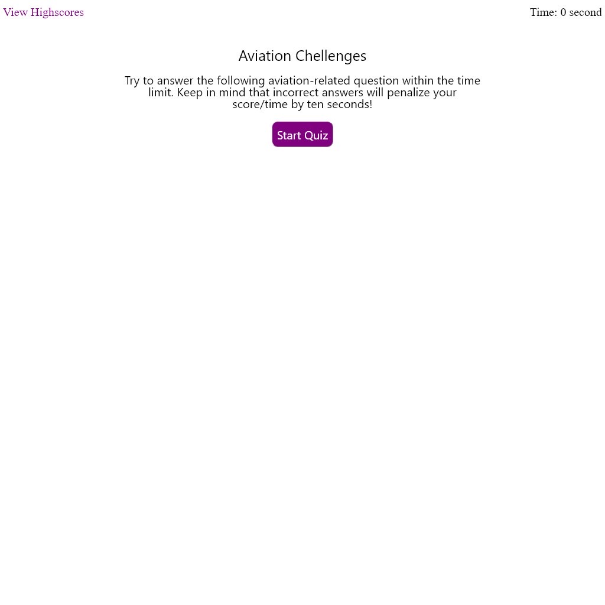

# aviation-quiz

## Description
This web app is a simple timed quiz regarding aviation. Once started, user will have 75 seconds to answer six questions.

At the end of the quiz, user can see their score (as the remain time left), enter they initials and compare against the previous top score from the local storage.

## Screenshot of the Application

## Features
- Option in the Highscores page to clear the past high scores from the local storage.
